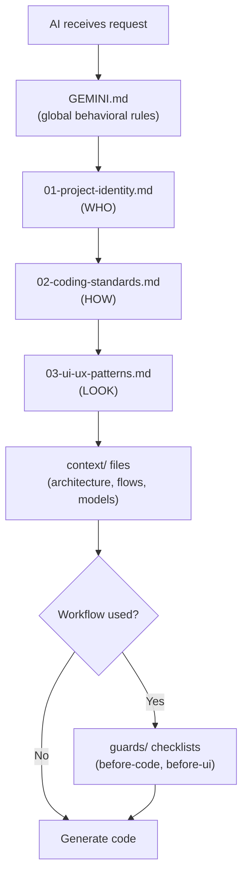

# SplitSmart — Agent Kit Architecture

> Project-specific AI constraint kit for consistent code generation.

---

## 📋 Overview

This kit ensures AI models consistently follow project conventions through a layered constraint system:

- **3 Rule Files** — Project identity, coding standards, UI/UX patterns (loaded in order)
- **4 Context Files** — Living documentation of architecture, flows, data models, decisions
- **2 Guard Files** — Pre-flight checklists enforced before code/UI generation
- **5 Agents** — Specialist AI personas for different tasks
- **21 Skills** — Domain-specific knowledge modules
- **11 Workflows** — Slash command procedures

---

## 🏗️ Directory Structure

```plaintext
.agent/
├── ARCHITECTURE.md          # This file
├── rules/                   # Ordered constraint rules (01 → 02 → 03)
│   ├── 01-project-identity.md   # WHO: Tech stack, structure, models
│   ├── 02-coding-standards.md   # HOW: Code style, prohibited patterns
│   └── 03-ui-ux-patterns.md     # LOOK: Design system, interactions
├── context/                 # Living project context
│   ├── architecture.md      # System architecture & Product PRD
│   ├── app-flow.md          # Screen map & user flows
│   ├── data-models.md       # Schemas, hooks, stores
│   ├── decisions.md         # ADR log (8 decisions)
│   ├── operations.md        # Deployment & Troubleshooting
│   └── prd.md               # Product Requirement Document
├── guards/                  # Pre-flight checklists
│   ├── before-code.md       # Code generation checklist
│   └── before-ui.md         # UI generation checklist
├── agents/                  # 5 specialist agents
├── skills/                  # 21 project-relevant skills
└── workflows/               # 11 slash commands
```

---

## 🔄 Constraint Loading Order



---

## 🤖 Agents (5)

| Agent | Focus |
|---|---|
| `orchestrator` | Multi-agent coordination |
| `project-planner` | Discovery, task planning |
| `mobile-developer` | React Native, Expo |
| `test-engineer` | Testing strategies |
| `debugger` | Root cause analysis |

---

## 🧩 Skills (21)

| Category | Skills |
|---|---|
| **UI/UX** | heroui-native, building-native-ui, frontend-design |
| **Data** | tanstack-query, native-data-fetching, supabase-postgres-best-practices |
| **Framework** | react-native-best-practices, vercel-react-native-skills, vercel-react-best-practices |
| **Expo** | expo-api-routes, expo-deployment, expo-dev-client, upgrading-expo, expo-cicd-workflows |
| **Animation** | reanimated-skia-performance |
| **Language** | typescript-expert |
| **Debug** | systematic-debugging |
| **Docs** | mermaid-diagrams |
| **AI** | ai-sdk |
| **Utils** | use-dom, find-skills, skill-creator |

---

## 🔄 Workflows (11)

| Command | Description |
|---|---|
| `/brainstorm` | Structured idea exploration |
| `/create` | Create new features |
| `/debug` | Systematic debugging |
| `/deploy` | Deploy application |
| `/enhance` | Add/update features (with guards) |
| `/orchestrate` | Multi-agent coordination |
| `/plan` | Task breakdown |
| `/preview` | Preview changes |
| `/status` | Check project status |
| `/test` | Run tests |
| `/ui-ux-pro-max` | UI design with style options |
