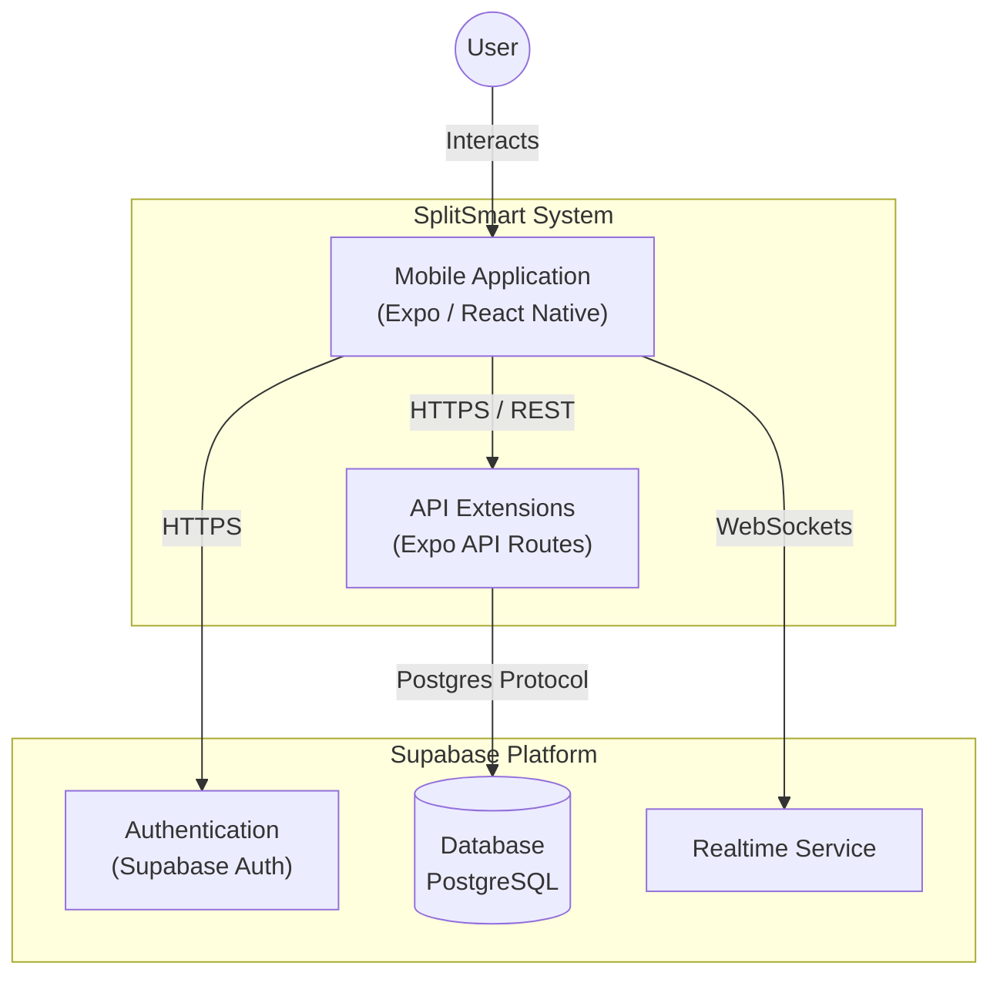

# Architecture — Living Context

> This file is the single source of truth for the current system architecture.
> Update this file when architectural changes are made.

## Product Context

**SplitSmart (Expense)** is a mobile application designed to simplify expense sharing among groups (roommates, travelers, friends).
- **Core Goal**: Track shared expenses, calculate debts, and settle up with VietQR.
- **Target Audience**: Roommates, travelers, and social groups.
- **Key Workflows**: Group management, multi-mode expense splitting, automated debt calculation, and payment confirmation.

## System Overview (C4 Context)



## Frontend Architecture

| Layer | Technology | Responsibility |
|---|---|---|
| **Framework** | Expo (Managed Workflow) | App shell, native APIs |
| **Routing** | Expo Router | File-based navigation |
| **Server State** | TanStack React Query v5 | Caching, sync, optimistic updates |
| **Global State** | Zustand | Session, theme, temporary state |
| **UI Library** | HeroUI Native | Component primitives |
| **Styling** | Uniwind (Tailwind CSS) | className-based styling |

## Backend Architecture (Supabase)

| Component | Technology | Responsibility |
|---|---|---|
| **Database** | PostgreSQL 15+ | Primary data store (Users, Groups, Expenses) |
| **Auth** | GoTrue (Supabase) | Identity provider (Email/Password, OAuth), JWT |
| **Realtime** | Supabase Realtime | Broadcasts DB changes to connected clients |
| **API Routes** | Expo API Routes | Server-side logic for sensitive operations |

## Data Flow

```
User Action → React Component → TanStack Query Hook
    → API Client (lib/api-client.ts) → Expo API Route (app/api/)
    → Supabase Server Client → PostgreSQL
    → Response → Query Cache → UI Update
```

## Security

- **RLS (Row Level Security)**: Mandatory on all Supabase tables.
- **Auth Tokens**: JWT managed by Supabase Auth, injected by `api-client.ts`.
- **Server-side validation**: Zod schemas on API routes.

## Deployment

- **Mobile**: EAS Build (`.apk`, `.ipa`) + EAS Update (OTA)
- **Backend**: Supabase Cloud (managed)
- **Dev**: `bun run dev` → Expo Go / Dev Client
