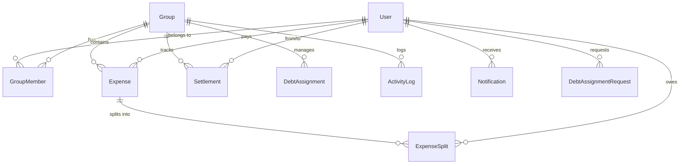
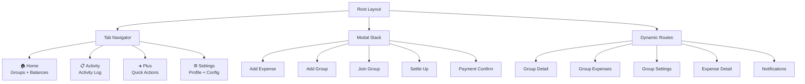

# Product Requirement Document (PRD) — SplitSmart

**Project**: SplitSmart (Expense)
**Version**: 1.0
**Status**: Active Development
**Last Updated**: 2026-02-26

---

## 1. Overview

### 1.1 Purpose

SplitSmart là ứng dụng mobile giúp quản lý chi tiêu nhóm — chia tiền, tính nợ tự động, và thanh toán qua VietQR. Ứng dụng giải quyết bài toán "ai nợ ai bao nhiêu" trong các nhóm bạn bè, đi du lịch, hoặc ở chung.

### 1.2 Target Audience

| Segment | Use Case |
|---|---|
| **Roommates** | Chia tiền thuê nhà, điện nước, mua sắm hàng ngày |
| **Travelers** | Chia chi phí chuyến đi (khách sạn, ăn uống, vé tham quan) |
| **Social Groups** | Chia tiền tiệc, sự kiện, quà tặng nhóm |
| **Couples** | Theo dõi chi tiêu chung, cân bằng tài chính |

### 1.3 Success Metrics

| Metric | Target |
|---|---|
| Thời gian tạo expense | < 15 giây |
| Thanh toán VietQR | < 3 bước |
| Tham gia nhóm qua QR | < 5 giây |
| App launch → interactive | < 2 giây |

---

## 2. Tech Stack & Architecture

> 📎 Chi tiết: [01-project-identity.md](file:///Users/doanhv/Documents/doanhv/expense/.agent/rules/01-project-identity.md) | [architecture.md](file:///Users/doanhv/Documents/doanhv/expense/.agent/context/architecture.md)

| Layer | Technology | Skill Reference |
|---|---|---|
| **Framework** | Expo (Managed Workflow) + Expo Router | `building-native-ui`, `expo-api-routes` |
| **Language** | TypeScript (strict mode) | `typescript-expert` |
| **UI** | HeroUI Native + Uniwind | `heroui-native` |
| **Animations** | react-native-reanimated | `reanimated-skia-performance` |
| **Server State** | TanStack React Query v5 | `tanstack-query` |
| **Global State** | Zustand | `vercel-react-native-skills` |
| **Backend** | Supabase (Auth + PostgreSQL + Realtime) | `supabase-postgres-best-practices` |
| **API Layer** | Expo API Routes (`app/api/`) | `expo-api-routes` |
| **Data Fetching** | `lib/api-client.ts` | `native-data-fetching` |
| **Performance** | FlashList, React.memo, useMemo | `react-native-best-practices` |
| **Deployment** | EAS Build + EAS Update | `expo-deployment`, `expo-cicd-workflows` |
| **Dev Client** | Expo Dev Client | `expo-dev-client` |
| **Upgrading** | Expo SDK upgrades | `upgrading-expo` |

---

## 3. Functional Requirements

### 3.1 Authentication (FR-AUTH)

| ID | Feature | Description | Status |
|---|---|---|---|
| FR-AUTH-01 | Sign Up | Email/Password registration via Supabase Auth | ✅ |
| FR-AUTH-02 | Sign In | Email/Password login with persistent session | ✅ |
| FR-AUTH-03 | OAuth | Google/Apple sign-in | 🔲 Planned |
| FR-AUTH-04 | Profile | Quản lý tên, avatar, thông tin thanh toán | ✅ |
| FR-AUTH-05 | Session | Auto-refresh JWT, logout, token expiry handling | ✅ |

**Data Models**: `User`
**Hooks**: `use-auth.ts`
**API**: `profile+api.ts`
**Store**: `auth-store.ts`

---

### 3.2 Group Management (FR-GROUP)

| ID | Feature | Description | Status |
|---|---|---|---|
| FR-GROUP-01 | Create Group | Tạo nhóm với tên, mô tả, loại (`trip`/`home`/`couple`/`other`), currency | ✅ |
| FR-GROUP-02 | Join via Code | Nhập mã mời để tham gia nhóm | ✅ |
| FR-GROUP-03 | Join via QR | Scan QR code → auto-join → redirect to group detail | ✅ |
| FR-GROUP-04 | Group Settings | Chỉnh sửa tên, ảnh bìa, quản lý thành viên | ✅ |
| FR-GROUP-05 | Member Roles | 3 roles: `owner`, `admin`, `member` | ✅ |
| FR-GROUP-06 | Leave/Delete | Rời nhóm hoặc xóa (chỉ owner) | ✅ |
| FR-GROUP-07 | Invite Code | Auto-generated unique code per group | ✅ |

**Data Models**: `Group`, `GroupMember`, `GroupWithDetails`
**Hooks**: `use-groups.ts`
**API**: `groups+api.ts`, `groups/[id]+api.ts`, `groups/join+api.ts`
**Store**: `groups-store.ts`

**Screens**:
| Screen | Route | Purpose |
|---|---|---|
| Home | `(tabs)/index.tsx` | Group list + balances |
| Add Group | `(modal)/add-group.tsx` | Create group form |
| Join Group | `(modal)/join-group.tsx` | QR scan + code input |
| Group Detail | `group/[id]/` | Group dashboard |
| Group Settings | `group/[id]/settings.tsx` | Member management |

---

### 3.3 Expense Management (FR-EXP)

| ID | Feature | Description | Status |
|---|---|---|---|
| FR-EXP-01 | Create Expense | Nhập số tiền, mô tả, ngày, chọn người trả, chọn người tham gia | ✅ |
| FR-EXP-02 | Split Modes | Chia đều (equal split), chia tùy chỉnh (custom amounts) | ✅ |
| FR-EXP-03 | Categories | 7 loại: `food`, `transport`, `accommodation`, `entertainment`, `shopping`, `utilities`, `other` | ✅ |
| FR-EXP-04 | Expense List | Danh sách expense theo nhóm, có filter theo category/member | ✅ |
| FR-EXP-05 | Expense Detail | Chi tiết breakdown splits, thông tin người trả | ✅ |
| FR-EXP-06 | Edit/Delete | Chỉnh sửa hoặc xóa expense (với optimistic updates) | ✅ |
| FR-EXP-07 | Receipt Attach | Đính kèm ảnh hóa đơn | 🔲 Planned |

**Data Models**: `Expense`, `ExpenseSplit`, `ExpenseCategory`
**Hooks**: `use-expenses.ts`
**API**: `expenses+api.ts`, `expenses/[id]+api.ts`

**Screens**:
| Screen | Route | Purpose |
|---|---|---|
| Add Expense | `(modal)/add-expense.tsx` | Expense creation form |
| Group Expenses | `group/[id]/expenses.tsx` | Filtered expense list |
| Expense Detail | `expense/[id]/` | Split breakdown |

---

### 3.4 Debt Calculation & Settlement (FR-DEBT)

| ID | Feature | Description | Status |
|---|---|---|---|
| FR-DEBT-01 | Balance Calc | Tính toán số dư mỗi thành viên (positive = được nợ, negative = đang nợ) | ✅ |
| FR-DEBT-02 | Optimized Debt | Two-pointer algorithm: tối thiểu hóa số giao dịch cần thanh toán | ✅ |
| FR-DEBT-03 | Settle Up | Ghi nhận thanh toán giữa 2 người (pending → completed/rejected) | ✅ |
| FR-DEBT-04 | VietQR Payment | Tạo mã QR VietQR để chuyển khoản ngân hàng | ✅ |
| FR-DEBT-05 | Confirm Flow | Payer claim → Receiver confirm → Debt cleared | ✅ |

**Data Models**: `Debt`, `Settlement`, `UserBalance`, `IndividualDebt`
**Hooks**: `use-settlements.ts`, `use-group-balance.ts`
**API**: `settlements+api.ts`
**Utils**: `debt-calculator.ts` (6 functions)

**Debt Algorithms** (`lib/utils/debt-calculator.ts`):

| Function | Purpose |
|---|---|
| `calculateBalances()` | Tính balance từ expense splits |
| `calculateBalancesSimple()` | Tính balance khi chia đều |
| `assignDebtsOptimized()` | Two-pointer: minimize transactions |
| `assignDebtsWithAssignee()` | Star topology: tất cả nợ qua 1 người |
| `calculateIndividualDebts()` | Chi tiết nợ theo từng expense |
| `getUserBalances()` | Balance array với user info |

**Screens**:
| Screen | Route | Purpose |
|---|---|---|
| Settle Up | `(modal)/settle-up.tsx` | Settlement form |
| Payment Confirm | `(modal)/payment-confirm.tsx` | VietQR confirmation |

---

### 3.5 Debt Assignment (FR-ASSIGN)

| ID | Feature | Description | Status |
|---|---|---|---|
| FR-ASSIGN-01 | Request | Gửi yêu cầu ủy quyền nợ cho 1 thành viên | ✅ |
| FR-ASSIGN-02 | Approve/Reject | Admin duyệt hoặc từ chối yêu cầu | ✅ |
| FR-ASSIGN-03 | Star Topology | Khi active: tất cả nợ được route qua assignee | ✅ |
| FR-ASSIGN-04 | Deactivate | Hủy ủy quyền (status → inactive) | ✅ |

**Data Models**: `DebtAssignment`, `DebtAssignmentRequest`, `AssigneeDebt`
**Hooks**: `use-debt-assignments.ts`, `use-debt-assignment-requests.ts`
**API**: `debt-assignments+api.ts`, `debt-assignment-requests+api.ts`

---

### 3.6 Activity & Notifications (FR-ACTIVITY)

| ID | Feature | Description | Status |
|---|---|---|---|
| FR-ACT-01 | Activity Feed | Danh sách hành động trong nhóm (expense, settlement, member changes) | ✅ |
| FR-ACT-02 | Action Types | 12 loại: `expense_created/updated/deleted`, `settlement_created/completed/rejected`, `group_member_added/removed/role_changed`, `group_updated`, `debt_assignment_created/updated` | ✅ |
| FR-ACT-03 | Notifications | 9 loại notification: expense, settlement, group, debt assignment events | ✅ |
| FR-ACT-04 | Read Status | Mark as read, unread count badge | ✅ |
| FR-ACT-05 | Push Notifications | Real-time alerts | 🔲 Planned |

**Data Models**: `ActivityLog`, `Notification`
**Hooks**: `use-activity.ts`, `use-notifications.ts`
**API**: `activity+api.ts`, `notifications+api.ts`

**Screens**:
| Screen | Route | Purpose |
|---|---|---|
| Activity | `(tabs)/activity.tsx` | Full activity log |
| Notifications | `notifications/` | Notification list |

---

### 3.7 Search (FR-SEARCH)

| ID | Feature | Description | Status |
|---|---|---|---|
| FR-SEARCH-01 | Global Search | Tìm kiếm across groups, expenses, members | ✅ |

**Hooks**: `use-search.ts`
**API**: `search+api.ts`

---

### 3.8 Realtime (FR-RT)

| ID | Feature | Description | Status |
|---|---|---|---|
| FR-RT-01 | Realtime Sync | Supabase Realtime: tự động cập nhật khi có thay đổi từ user khác | ✅ |

**Hooks**: `use-realtime.ts`

---

## 4. Non-Functional Requirements

### 4.1 Performance

| Requirement | Target | Skill Reference |
|---|---|---|
| List rendering | FlashList + `estimatedItemSize` | `react-native-best-practices` |
| Animations | 60fps, spring-based via Reanimated | `reanimated-skia-performance` |
| Image loading | WebP, lazy loading via `expo-image` | `vercel-react-native-skills` |
| JS Thread | No blocking > 16ms | `react-native-best-practices` |
| TTI (Time to Interactive) | < 2s on mid-range device | `react-native-best-practices` |

### 4.2 Security

| Requirement | Implementation |
|---|---|
| Data isolation | PostgreSQL RLS on all tables |
| Auth tokens | JWT via Supabase Auth, auto-refresh |
| Input validation | Zod schemas on API routes |
| Server-side auth | `supabase-server.ts` with service key |

> 📎 Skill: `supabase-postgres-best-practices`

### 4.3 UI/UX

| Requirement | Implementation | Skill Reference |
|---|---|---|
| Design system | HeroUI Native components | `heroui-native` |
| Styling | Uniwind (Tailwind CSS for RN) | `heroui-native` |
| Dark/Light mode | CSS variables in `global.css` | `building-native-ui` |
| Touch feedback | PressableFeedback + haptics | `building-native-ui` |
| Typography | Inter (body) + IBM Plex Sans (headings) | `heroui-native` |

> 📎 Guards: [before-ui.md](file:///Users/doanhv/Documents/doanhv/expense/.agent/guards/before-ui.md)

### 4.4 Reliability

| Requirement | Implementation |
|---|---|
| Optimistic updates | TanStack Query mutation with rollback |
| Error boundaries | `ErrorBoundary` wrapping screen components |
| Offline viewing | Query cache persistence |

---

## 5. Data Model Summary

> 📎 Chi tiết: [data-models.md](file:///Users/doanhv/Documents/doanhv/expense/.agent/context/data-models.md)

### Entity Relationship

### Database Migrations (8 total)

| Migration | Purpose |
|---|---|
| `001_create_notifications_table` | Notification system |
| `002_create_activity_log_table` | Activity logging |
| `003_add_database_indexes` | Performance indexes |
| `004_add_database_functions` | Stored procedures |
| `005_add_debt_assignment_tables` | Debt assignment feature |
| `006_add_groups_updated_at` | Group timestamps |
| `007_add_expenses_created_by` | Expense creator tracking |
| `20260131_add_group_spending_stats` | Group statistics |

---

## 6. API Endpoints (12 total)

| Endpoint | Method(s) | Purpose |
|---|---|---|
| `/api/groups` | GET, POST | List/Create groups |
| `/api/groups/[id]` | GET, PUT, DELETE | Group CRUD |
| `/api/groups/join` | POST | Join group by code |
| `/api/expenses` | GET, POST | List/Create expenses |
| `/api/expenses/[id]` | GET, PUT, DELETE | Expense CRUD |
| `/api/settlements` | GET, POST, PUT | Settlement management |
| `/api/debt-assignments` | GET, POST, PUT | Debt assignment CRUD |
| `/api/debt-assignment-requests` | GET, POST, PUT | Assignment requests |
| `/api/activity` | GET | Activity feed |
| `/api/notifications` | GET, PUT | Notification list + mark read |
| `/api/profile` | GET, PUT | User profile |
| `/api/search` | GET | Global search |

> 📎 Skill: `expo-api-routes`

---

## 7. Screen Map

> 📎 Chi tiết: [app-flow.md](file:///Users/doanhv/Documents/doanhv/expense/.agent/context/app-flow.md)

### Navigation Structure

---

## 8. Deployment & Operations

> 📎 Chi tiết: [operations.md](file:///Users/doanhv/Documents/doanhv/expense/.agent/context/operations.md)

| Environment | Platform | Method |
|---|---|---|
| **Development** | Local | `bun run dev` → Expo Go |
| **Staging** | EAS | `eas build --profile preview` |
| **Production** | App Store / Play Store | `eas build --profile production` + `eas submit` |
| **Hotfix** | OTA | `eas update --branch production` |
| **Backend** | Supabase Cloud | Managed (auto-scaling) |

> 📎 Skills: `expo-deployment`, `expo-cicd-workflows`, `expo-dev-client`

---

## 9. Architectural Decisions

> 📎 Chi tiết: [decisions.md](file:///Users/doanhv/Documents/doanhv/expense/.agent/context/decisions.md)

| ADR | Decision | Rationale |
|---|---|---|
| ADR-001 | Expo Managed Workflow | OTA updates, no native module management |
| ADR-002 | Supabase as BaaS | PostgreSQL + RLS + Realtime + Auth built-in |
| ADR-003 | TanStack Query v5 | Optimistic updates, cache invalidation |
| ADR-004 | HeroUI Native + Uniwind | Tailwind CSS for React Native |
| ADR-005 | Zustand | No provider hell, selective re-renders |
| ADR-006 | VietQR | Vietnam-specific payment standard |
| ADR-007 | Expo API Routes | Same codebase, shared types |
| ADR-008 | FlashList | 5-10x performance over FlatList |

---

## 10. Future Roadmap

| Priority | Feature | Description |
|---|---|---|
| 🔴 High | OAuth (Google/Apple) | FR-AUTH-03 |
| 🔴 High | Push Notifications | FR-ACT-05 |
| 🟡 Medium | Receipt Attachment | FR-EXP-07 |
| 🟡 Medium | Recurring Expenses | Auto-gen monthly expenses |
| 🟢 Low | Export CSV | Export expense history |
| 🟢 Low | Multi-currency | Auto-convert with exchange rates |
| 🟢 Low | Budget Alerts | Set spending limits per category |
