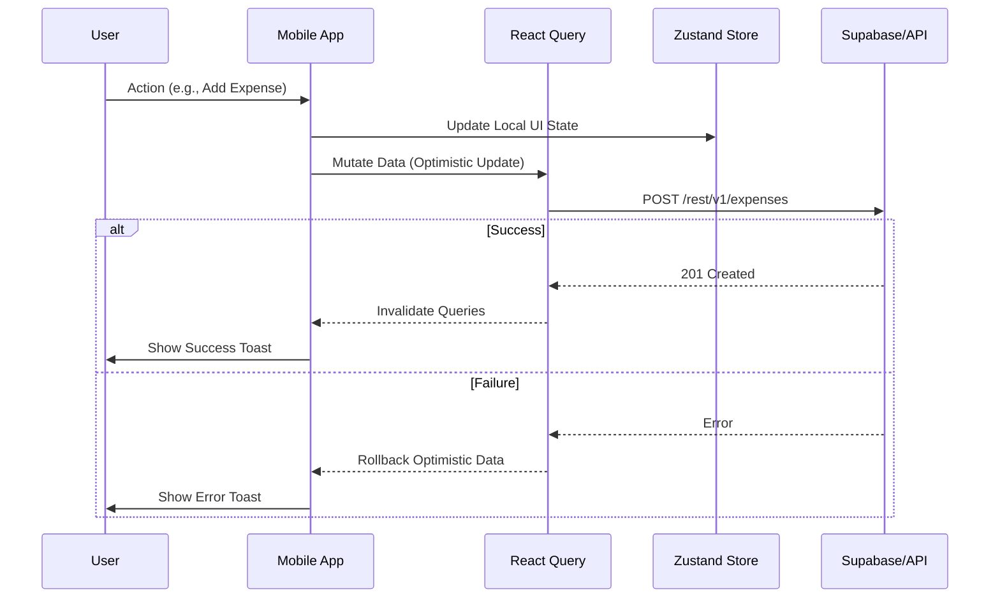

# Infrastructure Documentation

## Overview

**Project Name**: SplitSmart (Expense)
**Type**: Mobile Application (iOS/Android)
**Purpose**: Expense splitting and group management application for shared living/travel.
**Stack**: React Native (Expo), TypeScript, Supabase (PostgreSQL, Auth, Realtime).

## 1. High-Level Architecture (C4 Context)

The system consists of a mobile application used by end-users to manage expenses, interacting with a managed backend service (Supabase) for persistence and real-time updates.

```mermaid
graph TB
    User((User))
    
    subgraph "SplitSmart System"
        MobileApp[Mobile Application\n(Expo / React Native)]
        APILayer[API Extensions\n(Expo API Routes)]
    end
    
    subgraph "Supabase Platform"
        Auth[Authentication\n(Supabase Auth)]
        DB[(Database\nPostgreSQL)]
        Realtime[Realtime Service]
        Storage[Storage Bucket]
    end

    User -->|Interacts| MobileApp
    MobileApp -->|HTTPS / REST| APILayer
    MobileApp -->|WebSockets| Realtime
    APILayer -->|Postgres Protocol| DB
    MobileApp -->|HTTPS (Auth)| Auth
    MobileApp -->|Direct Read/Write| DB
```

## 2. Container Architecture

This section details the internal containers and their responsibilities.

### 2.1 Mobile Application (Frontend)
- **Framework**: Expo (Managed Workflow)
- **Routing**: Expo Router (File-based)
- **State Management**:
    - **Server State**: TanStack React Query (Caching, Synchronization)
    - **UI/Global State**: Zustand (Session, Theme, Temporary State)
- **UI library**: HeroUI Native + Uniwind (Tailwind CSS)

### 2.2 Backend Services (Supabase & API)
The backend is primarily "Serverless" via Supabase, supplemented by Expo API Routes for specific logic that requires trusted execution.

| Component | Technology | Responsibility |
|-----------|------------|----------------|
| **Database** | PostgreSQL 15+ | Primary data store. relational data (Users, Groups, Expenses). |
| **Auth** | GoTrue (Supabase) | Identity provider (Email/Password, OAuth). Handles JWT issuance. |
| **Realtime** | Supabase Realtime | Broadcasts database changes (Inserts/Updates) to connected clients. |
| **API API** | Expo API Routes | Server-side endpoints for sensitive logic (if any) or complex aggregations. |

### 2.3 Data Flow Architecture

The application follows an **Offline-First capable** strategy with optimistic updates using React Query.



## 3. Infrastructure & Deployment

### 3.1 Mobile Deployment (Expo)
- **Build Service**: EAS Build (Expo Application Services) - *To be configured*
- **Updates**: EAS Update (Over-the-air updates) - *Supported*
- **Environments**:
    - **Development**: `bun run dev` (Local Simulator/Device via Expo Go)
    - **Production**: Native Builds (`.apk`, `.ipa`) via EAS

### 3.2 Backend Infrastructure (Supabase)
- **Hosting**: Managed Cloud (Supabase.com)
- **Region**: *User Configured (e.g., Singapore/US)*
- **Configuration**:
    - **RLS (Row Level Security)**: MANDATORY. All tables must have RLS policies enabled.
    - **Migrations**: SQL-based migrations managed via Supabase CLI (if local dev enabled).

## 4. Security Model

### 4.1 Authentication
- **Mechanism**: JWT (JSON Web Tokens).
- **Flow**:
    1. User logs in via Supabase Auth.
    2. Access Token & Refresh Token stored in heavily secured storage (`expo-secure-store` recommened, currently `AsyncStorage`).
    3. Token attached to all API/DB requests via `Authorization` header.

### 4.2 Authorization (RBAC)
- **Implementation**: Row Level Security (RLS) in PostgreSQL.
- **Roles**:
    - `owner`: Full access to group.
    - `admin`: Can edit settings/members.
    - `member`: Read/Write expenses.

```sql
-- Example RLS Policy Concept
CREATE POLICY "Members can view group expenses"
ON expenses
FOR SELECT
USING (
  auth.uid() IN (
    SELECT user_id FROM group_members WHERE group_id = expenses.group_id
  )
);
```

### 4.3 Data Protection
- **Encryption**: TLS 1.2+ for transit, At-rest encryption (Supabase managed).
- **Sensitive Data**: Avoid storing plain-text sensitive info; rely on Auth provider for PII where possible.

## 5. Operational Procedures

### 5.1 Monitoring
- **Error Tracking**: *Not yet configured* (Recommended: Sentry).
- **Performance**: Expo Configured Reanimated Logger (Warn level).
- **Database**: Supabase Dashboard (Compute/Storage metrics).

### 5.2 Development Workflow
1. **Local Dev**: Run `bun dev`.
2. **Schema Changes**:
    - Create SQL migration.
    - Verify against local/staging DB.
    - Apply to Production via Supabase Dashboard or CLI.
3. **Release**:
    - Bump version in `app.json`.
    - Run `eas build` (if configured).

## 6. Recommendations (Brainstorm Output)

- **[Critical] Configure EAS for Builds**: Set up `eas.json` to automate build profiles (dev, preview, prod).
- **[Critical] Secure Storage**: Move authentication tokens from `AsyncStorage` to `expo-secure-store` for production security.
- **[Enhancement] Error Monitoring**: Integrate Sentry `sentry-expo` for real-time crash reporting.
- **[Enhancement] CI/CD**: Setup GitHub Actions to run `bun run lint` and `bun run test` (future) on PRs.
