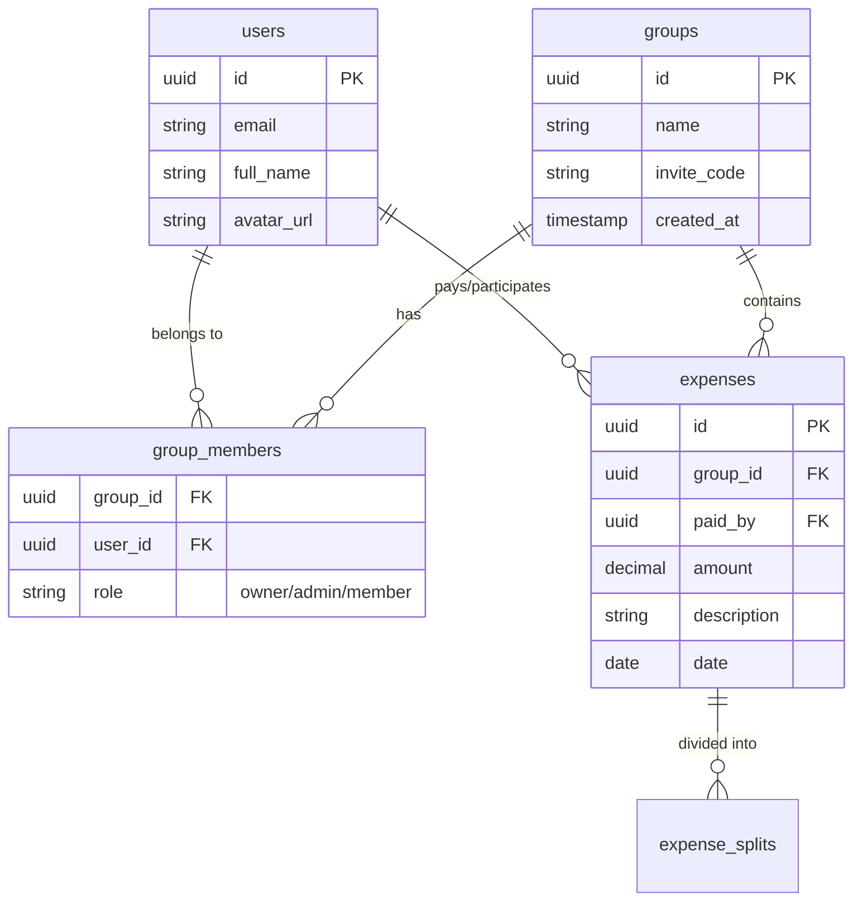

# Backend Structure

## 1. Database Schema (ERD)

The core data model revolves around **Groups**, **Users**, and **Expenses**.

## 2. API Routes (Expo API)

While most data access is direct to Supabase via the client SDK, some logic is handled via server-side API routes for validation or complex aggregations.

| Method | Route | Description |
| :--- | :--- | :--- |
| `POST` | `/api/groups/join` | Validates invite code and adds member. |
| `GET` | `/api/expenses/[id]` | Fetches detailed expense with split logic. |
| `POST` | `/api/settlements` | Handles complex settlement logic. |

## 3. Supabase Configuration

- **Realtime Channels**:
    - `expenses`: Listen for INSERT/DELETE to update group totals instantly.
    - `notifications`: Listen for user-specific alerts.
- **Triggers**:
    - `on_auth_user_created`: Automatically creates a `public.users` profile record when a new user signs up.
