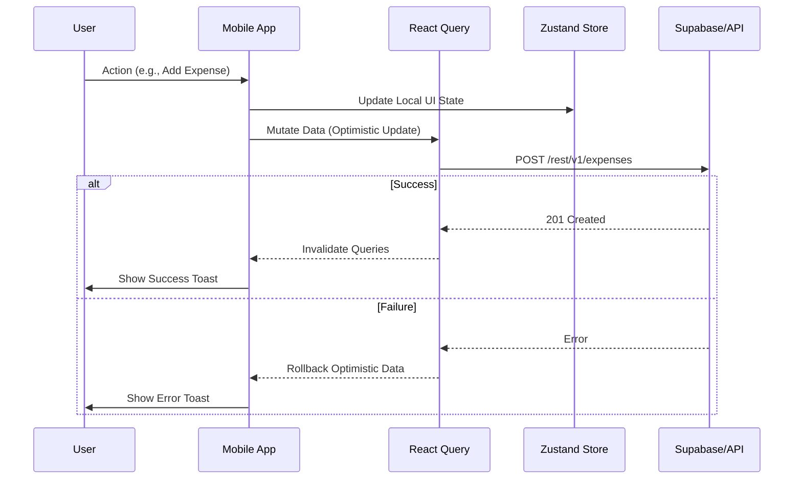

# Data Flow Architecture

The application follows an **Offline-First capable** strategy with optimistic updates using React Query.

## Standard Mutation Flow

## Key Principles

1.  **Optimistic UI**: Interactions should feel instant. We update the UI immediately assuming success, and rollback if the server request fails.
2.  **Server State Synchronization**: `TanStack React Query` is the source of truth for server data. Avoid duplicating server data in global Zustand stores unless necessary for session-wide access (e.g., Auth).
3.  **Real-time Updates**: Functionality requiring immediate awareness (like Chat or Notifications) subscribes to Supabase Realtime channels to refresh React Query caches.
