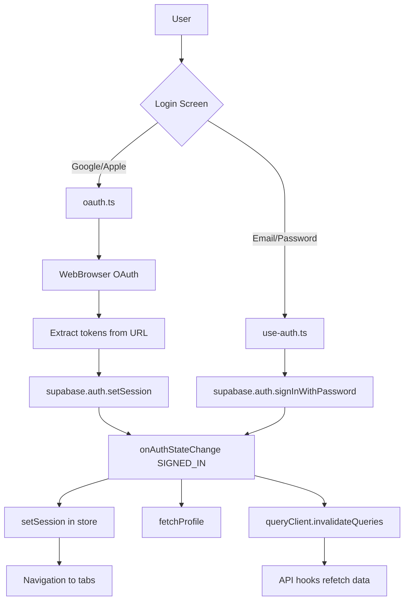
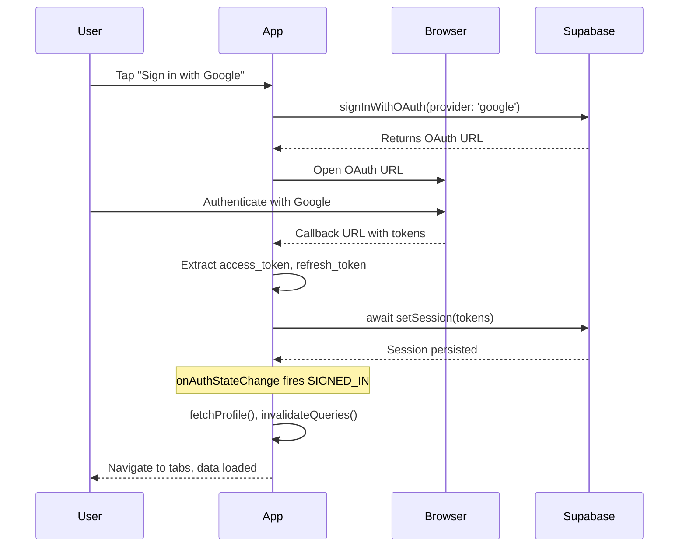
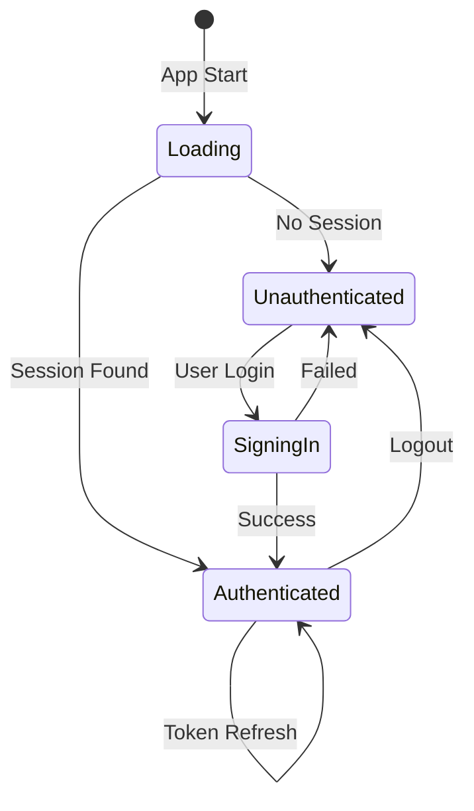

# Authentication Flow Documentation

## Overview

Ứng dụng sử dụng **Supabase Auth** với **OAuth providers** (Google, Apple) và email/password. Flow được thiết kế theo [Expo Authentication Docs](https://docs.expo.dev/develop/authentication/) và [Supabase Expo Tutorial](https://supabase.com/docs/guides/getting-started/tutorials/with-expo-react-native).

---

## Architecture



---

## Key Files

| File | Role |
|------|------|
| [auth-store.ts](file:///Users/doanhv/Documents/doanhv/expense/lib/stores/auth-store.ts) | Zustand store for auth state (`user`, `session`, `isAuthenticated`) |
| [use-auth.ts](file:///Users/doanhv/Documents/doanhv/expense/lib/hooks/use-auth.ts) | Auth hook with session listener and profile fetching |
| [oauth.ts](file:///Users/doanhv/Documents/doanhv/expense/lib/auth/oauth.ts) | OAuth flows for Google/Apple sign-in |
| [supabase.ts](file:///Users/doanhv/Documents/doanhv/expense/lib/supabase.ts) | Supabase client initialization |

---

## Session Management

### Pattern từ Supabase Tutorial

```typescript
useEffect(() => {
    // 1. Get initial session from Supabase storage
    supabase.auth.getSession().then(({ data: { session } }) => {
        setSession(session);
        if (session?.user) {
            fetchProfile();
        }
    });

    // 2. Listen for auth state changes
    supabase.auth.onAuthStateChange((event, session) => {
        setSession(session);
        
        if (event === 'SIGNED_IN') {
            fetchProfile();
            queryClient.invalidateQueries();
        } else if (event === 'SIGNED_OUT') {
            logout();
            queryClient.clear();
        }
    });
}, []);
```

### Auth Events Handled

| Event | Action |
|-------|--------|
| `SIGNED_IN` | Set session, fetch profile, invalidate queries |
| `SIGNED_OUT` | Clear session, logout, clear query cache |
| `TOKEN_REFRESHED` | Invalidate queries to refetch with new token |

---

## OAuth Flow (Google/Apple)



### Key Implementation

```typescript
// oauth.ts - signInWithGoogle()
const { error } = await supabase.auth.setSession({
    access_token: tokens.accessToken,
    refresh_token: tokens.refreshToken,
});
// onAuthStateChange will handle the rest
```

---

## API Hooks - Session Gate

Tất cả hooks fetching data từ API có `enabled: !!session` để đảm bảo:

1. Không fetch khi chưa có session
2. Tự động fetch khi session ready (via invalidateQueries)

```typescript
// use-groups.ts
export const useGroups = () => {
    const session = useAuthStore((state) => state.session);
    return useQuery({
        ...groupsQueryOptions,
        enabled: !!session,  // Only fetch when session exists
    });
};
```

### Hooks với Session Gate

- `useGroups()`, `useGroup()`
- `useRecentExpenses()`, `useExpenses()`
- `useGroupActivity()`, `useRecentActivity()`
- `useNotifications()`, `useUnreadNotificationsCount()`
- `useSettlements()`, `usePendingSettlements()`

---

## Navigation Protection

### Current Pattern (Redirect)

```typescript
// (tabs)/_layout.tsx
if (!isAuthenticated && !isLoading) {
    return <Redirect href="/(onboarding)" />;
}
```

### Expo Router v5 Protected Routes (Optional Upgrade)

```tsx
<Stack.Protected guard={isAuthenticated}>
    <Stack.Screen name="(tabs)" />
</Stack.Protected>
```

---

## State Flow



---

## Troubleshooting

### Data không load sau login

**Nguyên nhân**: `setSession()` được gọi nhưng chưa await.

**Giải pháp**: Đảm bảo await `setSession()` trước khi return từ OAuth function.

### Session mất sau restart app

**Nguyên nhân**: Supabase không persist session properly.

**Giải pháp**: 
1. Check `supabase.ts` có `persistSession: true`
2. `getSession()` được gọi on mount trong `use-auth.ts`

### API 401 errors

**Nguyên nhân**: Query fetch trước khi session ready.

**Giải pháp**: Check các hooks có `enabled: !!session`.
