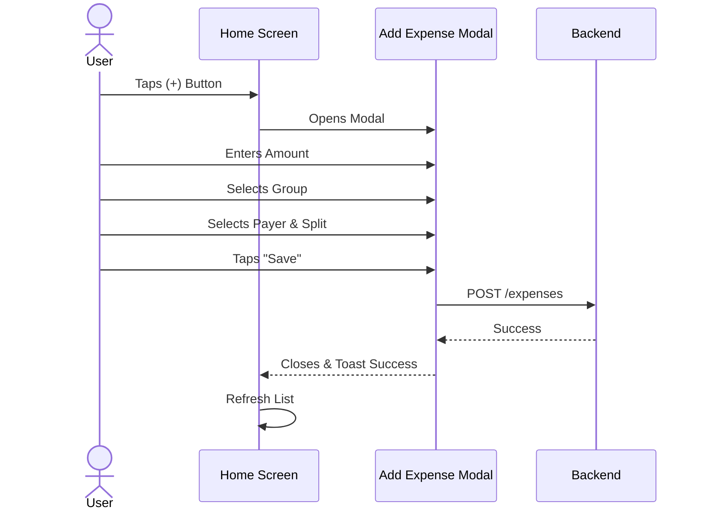
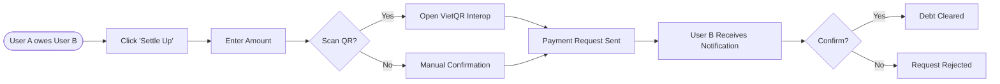

# App Flow & Navigation

This document visualizes the core user flows and screen transitions within the application.

## 1. High-Level Navigation Map

```mermaid
graph TD
    Start((Launch)) --> AuthCheck{Authenticated?}
    
    AuthCheck -->|No| OnboardingFlow
    AuthCheck -->|Yes| MainTabs
    
    subgraph OnboardingFlow [Onboarding]
        Welcome[Welcome Screen]
        Login[Login / Sign Up]
        Tutorial[Tutorial / Intro]
    end
    
    subgraph MainTabs [Main App (Tabs)]
        TabHome[Home Tab]
        TabGroups[Groups Tab]
        TabActivity[Activity Tab]
        TabProfile[Profile Tab]
        TabPlus[(+)]
    end
    
    OnboardingFlow --> MainTabs
    
    TabGroups --> GroupDetail[Group Detail Screen]
    TabPlus --> AddExpense[Add Expense Modal]
    TabPlus --> AddGroup[Add Group Modal]
    
    GroupDetail --> GroupSettings[Group Settings]
    GroupDetail --> SettleUp[Settle Up Flow]
```

## 2. Detailed User Flows

### 2.1 Expense Creation Flow



### 2.2 Settlement Flow


